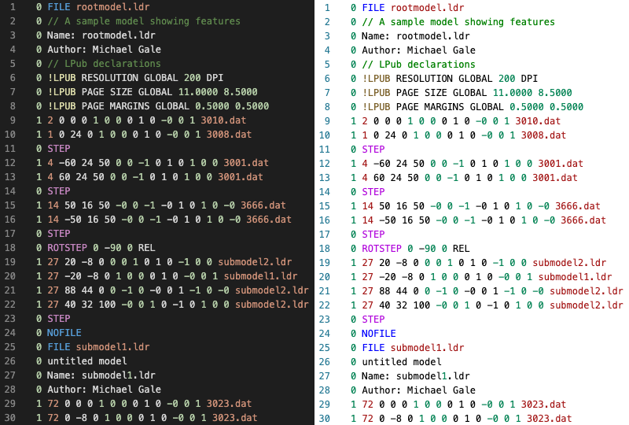

# LDraw for Visual Studio Code 


This repository contains a language support extension to Visual Studio Code for [LDraw](https://www.ldraw.org) files.

LDraw is an open standard for LEGO® CAD software.  It is based on a hierarchy of elements describing primitive shapes up to complex LEGO models and scenes. 

## Syntax Highlighting

This extension provides convenient syntax highlighting for working with LDraw files.  It recognizes all LDraw keywords and some keywords/meta-commands from other tools such as LPub and LSynth.  Lines that contain primitives (line types 1-5) have elements such as colour, coordinates, and matrix coefficients indiviually highlighted into groups for easy visual parsing.




## Installation

Copy the LDraw extension to the VSCode extension directory:

- **Windows**: `%USERPROFILE%\.vscode\extensions`
- **macOS/Linux**: `$HOME/.vscode/extensions`

```shell
    $ git clone https://github.com/michaelgale/ldraw-vscode.git
    $ cp -R ldraw-vscode ~/.vscode/extensions/ldraw-vscode
```

Restart VSCode and the extension should run automatically everytime you open a file with `.ldr`, `.dat` or `.mpd` file extension.

## References

- [LDraw.org](https://www.ldraw.org) - Official maintainer of the LDraw file format specification and the LDraw official part library.

### Lego CAD Tools

- [Bricklink stud.io](https://www.bricklink.com/v3/studio/download.page) new and modern design tool designed and maintained by Bricklink
- [LeoCAD](https://www.leocad.org) cross platform tool
- [MLCAD](http://mlcad.lm-software.com) for Windows
- [Bricksmith](http://bricksmith.sourceforge.net) for macOS by Allen Smith (no longer maintained)
- [LDView](http://ldview.sourceforge.net) real-time 3D viewer for LDraw models

### LPub Instructions Tools

- Original [LPub](http://lpub.binarybricks.nl) publishing tool by Kevin Clague
- [LPub3D](https://trevorsandy.github.io/lpub3d/) successor to LPub by Trevor Sandy
- [Manual](https://sites.google.com/site/workingwithlpub/lpub-4) for Legacy LPub 4 tool (last version by Kevin Clague)

## Authors

**ldraw-vscode** was written by [Michael Gale](https://github.com/michaelgale)
